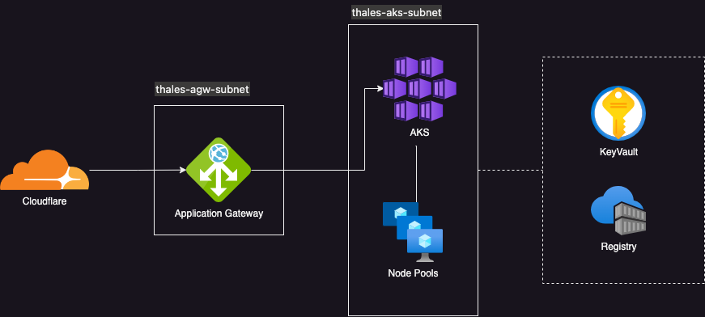

## Infrastructure
Applicaton are deployed to AKS on Azure Cloud.



### Tech Stack
```
IAAC - Terraform
Cloud - Azure
Platform - AKS
Secrets - Azure Key Vault
Package Manager - Helm
```

### Folder Structure

```
├── infra        - Stores infra as a code
├── kubernetes   - Stores kubernetes manifest files and helm charts
```

### Helm Package

A helm package is created: `Application`.

### Secrets Management

A key vault is created via terraform: `thaleskeyvault`.
Secrets are to be manually created in this vault.
The AKS is set up with key vault secrets provider, hence the secrets can be dynamically retrieved.

