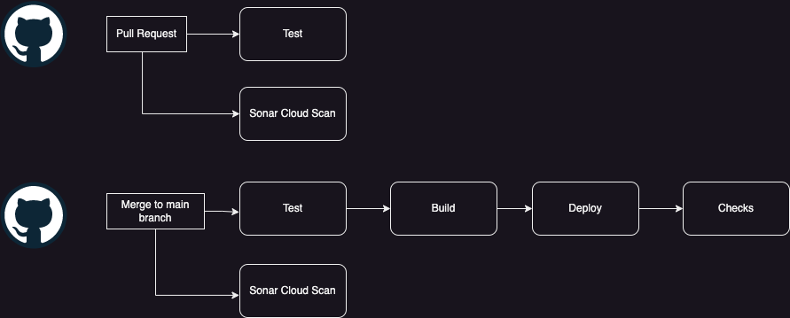

## Application

### Stages

Different stages will be executed based on these events.

1. On Pull Request

- Unit test
- Static code scan will be done by sonarcloud

2. On Merge to main branch

- Unit test
- Docker image created and pushed to Azure Cloud Registry
- The docker image are scanned by Trivy
- Application is deployed using Helm to AKS
- Health check 

